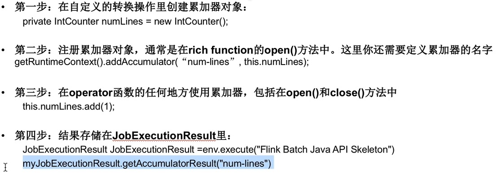

# Getting Started

#### 知识点：

> DataSet
>
> ​	DataSource
>
> DataStream
>
> ​	DataStreamSource   


> processFunction自定义算子


##### 重新分区策略：

>keyBy()：基于hash重新分区
>
>broadcast()：广播
>
>rebalance()：随机重新分区


##### 序列化

> POJO类  Avro序列化
>
> 一般通用类：Kryo序列化
>
> 值类型Values：ByteValue、IntValue等等
>
> Hadoop的Writable类：write() 和 readFields() 方法进行序列化逻辑


##### 类型擦除与推理

> Flink 重建被丢弃的类型，会存储在数据集中
>
> ​	DataStream.getType() 方法获取，由Flink自己使用


##### 累加器与计数器

> IntCounter、LongCounter、DoubleCounter
>
> Histogram：柱状图





##### 执行图

> StreamGraph
>
> ​	StreamTransformation
>
> ​	StreamNode & StreamEdge 
>
> JobGraph
>
> ​	Operator Chain：组合
>
> ​	JobVertex & JobEdge：符合条件的StreamNode chain成一个JobVertex
>
> ​	配置Checkpoint
>
> ​	配置重启策略	


#### 数据源

##### Source

> 基于文件
>
> 基于Socket
>
> 基于Collection

##### 自定义数据源

> 实现SourceFunction 非并行
>
> 实现ParallelSourceFunction
>
> 继承 RichParallelSourceFuntion

##### Sink

> Connectors

##### 自定义Sink

> 实现SinkFunction
>
> 实现RichSinkFunction


#### 编译源码
mvn clean install -DskipTests

// 跳过测试、QA插件和Javadoc

mvn clean install -DskipTests -Dfast 
mvn clean install -DskipTests -Dfast -Dhadoop.version=2.8.3
mvn clean install -DskipTests -Dfast -Pvendor-repos -Dhadoop.version=3.1.1-hdp3.1.0
mvn clean install -Dmaven.test.skip -Dfast -Pvendor-repos -Dhadoop.version=3.1.1-hdp3.1.0


#### Java表达式

```java
public static class Wc {
	private Wcc wcc;
	private int count;
	...getter,setter
}

public static class Wcc{
	private int num;
	private Tuple3<Long,Long,String> word;
	private IntWritable hadoopCitizen;
}
```

> "count"
>
> "wcc"：递归选取Wcc的所有字段
>
> "wcc.word.f2"：Wcc类中的tuple word的第三个字段
>
> "wcc.hadoopCitizen"：选择hadoop intWritable类型
>
> KeySelector选取


#### 自定义函数

RichMapFunction<T1,T2>： 可进行数据库操作，一次打开

```java
public class KafkaSinkFunction extends RichFlatMapFunction<String, Object> {
  private Producer<String, String> producer;
  private String topic;
  private properties props;
  
  public KafkaSinkFunction(String topic, Properties props) {
    this.topic = topic;
    this.props = props;
  }
  
  @Override
  public void open(Configuration params) throw Exception {
    producer = new KafkaProducer<>(props);
  } 
  
  @Override
  public void close() throws Exception {
    producer.close();
  }
 
  @Override
  public void flatMap(String value, Collector<Object> out) throws Exception {
    producer.send(new ProducerRecord<String, String>(topic, new Random().nextInt()+"", JSON.toJSONString(value)));
  }
  
}
```

```java
@JSONField(serializeUsing=Decimal128Serializer.class, deserializeUsing=Decimal128Deserializer.clss)
private Decimal128 amount;
```


#### 共享Slot

TODO 条件

dataStream.filter(…).map().startNewChain().reduce()：连同map一起开启新的链路


#### 博客

1. 为什么我们选择基于Flink搭建实时个性化营销平台
    https://mp.weixin.qq.com/s/A04LKJbK6kOKSBCfKG5Ypg
2. Flink SQL 功能解密系列 —— 维表 JOIN 与异步优化
    https://yq.aliyun.com/articles/457385
3. EFK
    https://www.elastic.co/cn/blog/building-real-time-dashboard-applications-with-apache-flink-elasticsearch-and-kibana
4. 博客
     http://wuchong.me/categories/Flink/
     http://www.54tianzhisheng.cn/tags/Flink/

5. 源码：
    https://blog.csdn.net/yanghua_kobe
    
[OPPO数据中台之基石](https://mp.weixin.qq.com/s?__biz=MzU5OTQ1MDEzMA==&mid=2247486279&idx=1&sn=3b73e76a5597879a04bf671e93d6959d&chksm=feb5fc3ac9c2752cd0dae6def3d412d37ff1613c69e532042fc4e22b19ca639a71c06f6c3aea&mpshare=1&scene=23&srcid=#rd)

