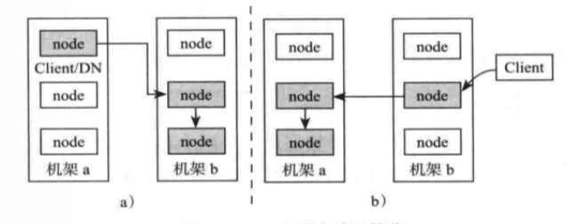
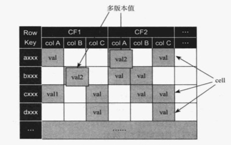
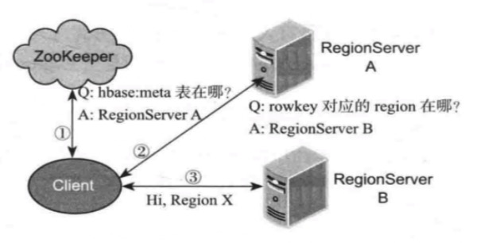
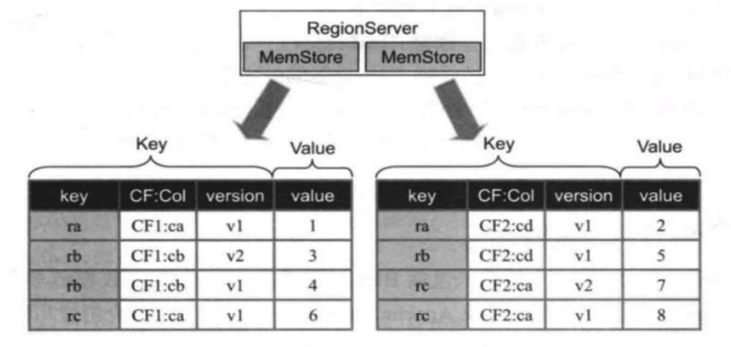
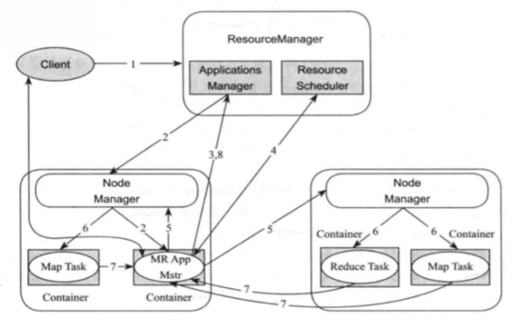
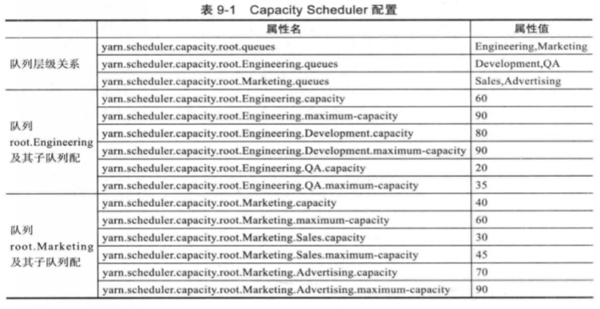
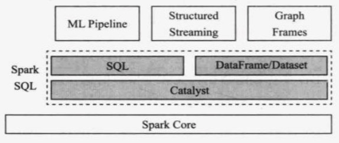
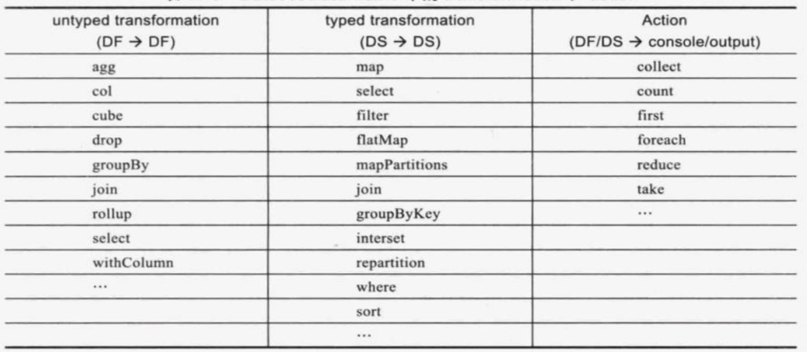

## Hadoop

1024GB=1TB ，P (1000个T) ，E （100万个T），Z （10亿个T）

### HDFS

#### 主从架构

Master：

> * NameNode ：存储管理元信息(文件目录树、文件数据块等)、管理DataNode(心跳检测、恢复)
>   * 配置HA ： 两个NameNode通过Zookeeper实现自动切换；利用JournalNode上存储的EditLog实现状态同步
> * SecondNameNode 
>   * 管理EditLog与fsimage(快照)
>   * 定时更新EditLog到fsimage，保证故障后的数据丢失，NameNode下次启动时会使用新的fsimage，直接启动，无需合并EditLog到fsimage，减少启动时间


Slave：

> * DataNode：存储数据、维持心跳


第三方共享存储系统：

> * JournalNode  : 利用2N+1台JournalNode存储EditLog。多数派


ViewFs：

> * 解决：NameNode存在的性能瓶颈
>   * 提供NameNode Federation机制，允许集群中存在多个NameNode对外服务，个NameNode各自管理目录树的一部分(对目录水平分片)
>   * 在NameNode Federation基础上抽象封装出文件系统视图 ViewFs，可将一个统一的目录命名空间映射到多个NameNode上
>   * 每个可对外提供服务的NameNode都需配备HA


#### 容错设计

心跳检测

- NameNode故障：Standby NameNode

- DataNode故障：副本机制

- 数据块损坏：DataNode存储数据时，会同时生成一个校验码，当获取数据时，如果发现校验码不对，则认为文件损坏，NameNode会通过其他节点上的副本来重构受损的数据块


#### 副本放置策略

集群架构：

​	多机架，多机房



默认3副本(可配置)

a) 客户端(任务) 和DataNode在同一节点

​	第一个副本写在该node上，其他节点写在另外机架的不同DataNode上

b) 客户端(Flume Sink)和DataNode不在同一节点

​	随机选择一个DataNode为第一个副本，其他节点写在另外机架的不同DataNode上


#### 异构存储介质

​	支持不同磁盘类型 Disk、SSD等


#### 集中式缓存管理

​	对热数据进行缓存


#### Shell：

```shell
# sudo -u hdfs
$ hdfs dfs -mkdir -p /tmp/test
$ sudo -u hdfs hdfs dfs -mkdir -p /tmp/csv
$ hdfs dfs -ls /tmp
$ vim /tmp/test1
$ hdfs dfs -put /tmp/test1 /tmp/test
$ hdfs dfs -ls /tmp/test
$ hdfs dfs -cat /tmp/test/test1
$ hdfs dfs -get /tmp/test /other/location
$ hdfs dfs -rm -r /tmp/test
$ hdfs dfs -du -h /
# 查询集群的状态
$ hdfs dfsadmin report 
# 文件一致性检查
$ hdfs fsck /tmp/test/test1 -files -blocks -locations -racks
# 分布式文件复制命令(集群内或集群外并行复制) hadoop版本高的地方执行该命令
$ hdfs diskcp hdfs://nn1:8020/user/test hdfs://nn2:8020/user/test
# 限制目录 /usr/test 最多使用2T空间
$ dfsadmin -setSpaceQuota 2t /user/test 
```


#### HDFS配置

副本数、数据块大小、修改特定文件的副本数、修改垃圾箱文件保留时间、现在DataNode磁盘使用空间、DataNode最多损坏磁盘数设置、允许将集群中某个DataNode加入黑名单

TODO


#### Java：

TODO


### HBase

​	分布式数据库：可保存海量数据，包含结构化和半结构化的数据，这类数据需要支持更新操作：如随机插入和删除。

#### 逻辑数据模型

​	类似数据库中的database和table，HBase将其称为 namespace 和 table

​	**HBase表由一系列行构成，每行数据有一个rowkey，以及若干 column family构成，每个column family包含无限制列**

- rowkey：标识数据，**类似主键，是定位该数据的索引**，同一张表内，rowkey是全局有序的，rowkey无数据类型，以 byte[] 形式保存
- column family：每行数据拥有相同的cf，cf属于schema的一部分，需在声明表时定义，可包含无数动态列，是访问控制的基本单位(存储数据单位)，同一cf中的数据在物理上存在同一文件中；cf名称类型为字符串，由一系列符合linux路径规则的字符组成
- column qualifier：cf中的列标识，可通过 family:quailfier(CF1:col1)唯一标识一列数据，qualifier不属于schema的一部分，可动态指定，每行数据可以有不同的cq，cq无数据类型，以 byte[] 形式保存
- cell：通过rowkey、column family、column qualifier可唯一定位一个cell，**cell内部保存了多个版本的数值**，默认情况下，每个数值的版本号为写入的**时间戳**，cell内的数据也是没有数据类型的，以数组形式保存
- timestamp：默认cell的版本号，类型为long，用户可自定义，**每个cf保留最大版本数可单独配置，默认为3**，**如果读数据时未指定版本号，HBase会返回最新版本的数值**，如果一个cell内版本号数量超过最大值，则旧的版本号会被删除




> * key/value
>
>   [rowkey, cf, cq, timestamp] -> value


#### 物理数据存储


#### 列簇式存储引擎

​	HBase不是列式存储引擎，而是列簇式存储引擎：同一列簇中的数据单独存储，但列簇内的数据是行式存储的，为此Kudu就出现了


#### 架构

Master/Slave架构

HBase为提供并行读写服务，按照rowkey将数据划分成多个固定大小的有序**分区(region)**，这些region会被均衡分配到不同节点上。所有的region会以文件的形式存储到HDFS上

Master不与Slave直接互连，而是通过Zookeeper进行解耦，使得Master完全无状态，避免了Master宕机导致集群不可用

- HMaster
  - 可以存在多个，由Zk进行Leader选举调度
  - 协调RegionServer：分配region、均衡各RegionServer的负载，发现失效的RegionServer并重新分配其上的region
  - 元信息管理：为用户提供增删改查操作
- RegionServer
  - 负责region的存储于管理(region切分)，并与客户端交互，处理读写请求。
- Client：客户端无须与HMaster交互，直接与RegionServer通信，维护Cache，加速访问
- Zookeeper：存储HBase重要元信息和状态信息
  - 保证集群只有一个Master
  - 存储所有Region的寻址入口
  - 实时监控RegionServer的状态，并通知给Master
  - 存储HBase的Schema和Table元信息


#### Region定位



hbase:meta表存放了每个表中rowkey区间与Region存放位置（RegionServer）的映射

rowkey: table name, start key, region id

value: RegionServer对象(保存RegionServer的位置信息)

> Client首次执行读写操作时才需要定位hbase:meta的位置，后续会缓存在本地，除非因region移动导致缓存失效，才会更新缓存


#### RegionServer内部组件

- BlockCache： 读缓存，基于LRU缓存淘汰算法，负责缓存频繁读取的数据
- MemStore：写缓存，负责暂时缓存未写入磁盘的数据，每个Region的每个column family拥有一个MemStore
- HFile：支持多级索引的数据存储格式，保存HBase中的实际数据，保存在HDFS中
- WAL：Write Ahead Log 保存在HDFS上的日志文件，用于保存那些未持久化到HDFS中的HBase数据，以便RegionServer宕机后恢复


#### RegionServer读写操作

> 写流程：
>
> ​	RS将收到的写请求数据暂存内存，后在顺序刷新到磁盘上，将随机写转化为顺序写，提升性能
>
> 1. RS接收到写请求，先将数据以追加的形式写入HDFS日志文件中(WAL)
>
> 2. RS将数据写入内存数据结构MemStore中，通知客户端写入成功
>
>    当**MemStore所占内存**达到一定阀值后，RS会将数据顺序刷新到HDFS中，保存成HFile


> 读流程：
>
> ​	由于写流程中数据可能存在内存或HDFS中，所以读需要从多个地方寻址数据，包括读缓存BlockCache、写缓存MemStore、HFile，并将读到的数据合并在一起返回给客户端
>
> 1. 扫描器查找读缓存BlockCache
> 2. 扫描器查找写缓存MemStore
> 3. 如果在BlockCache和MemStore中未发现目标数据，HBase将读取HFile中的数据


MemStore存储格式




HFile存储格式


> * 数据按照key升序排序
> * 文件由若干个64KB的Block构成，每个Block包含一系列Key/Value
> * 每个Block拥有自己的索引，称为Leaf Index，索引是按照key构建的
> * 每个Block的最后一个key被放到Intermediate Index中
> * 每个HFile有一个Root Index，指向Intermediate Index
> * 每个文件末尾包含一个 trailer 域，记录 block meta、bloom filter等信息


#### HBase访问

> Shell:
>
> - DDL: 
>   - **create `table_name`, `column family`**
>     - **只需要声明表名和CF名**
>   - list：列出所有HBase表
>   - disable：下线一张HBase表，不在提供读写服务，但不删除
>   - describe：描述
>   - drop：删除一张HBase表
> - DML：
>   - put
>     - put `table_name`, `rowkey`,`column family:column qualifier`, `value`
>   - get TODO check 获取HBase表中一个cell或一行的值
>     - get `table_name`, `rowkey`[,{COLUMN => `column family:column qualifier`}]  
>       - get `table_name`, `rowkey`
>       - get `table_name`, `rowkey`, {COLUMN => `column family:column qualifier`}
>   - delete
>     - delete `table_name`,`rowkey`,`column family:column qualifier`, `timestamp`
>     - delete `table_name`,`rowkey`
>   - scan 给定一个初始rowkey和结束rowkey，扫描并返回该区间内的数据
>     - scan `table_name`[,{filter1, filter2,….}]
>       - scan `table_name`
>       - scan `hbase:meta`, {COLUMN => `info:regioninfo`, LIMIT => 10}
>   - count
>     - count `table_name`


> API:
>
> - DDL  -> HBaseAdmin.class
> - DML -> HTable.class
>
> org.apache.hadoop.hbase.client.Connection    -> getAdmin() | getTable()


> 计算引擎：
>
> - TableInputFormat   读取HBase数据
>   - 以Region为单位划分数据(Region的设计就是为了上层能够并行处理)，每个Region会被映射为一个InputSplit，可被一个任务处理
> - TableOutputFormat  写入HBase
>   - 可将数据插入到HBase中
> - SQL查询引擎
>   - 利用Hive、Impala、Presto提供的SQL进行计算
>   - **使用SQL查询时，需将HBase中的表映射为一个关系型数据表**
>   - Apache Phoenix：SQL on HBase   **(推荐)**
>     - 将SQL转换为一系列HBase scan操作
>     - DDL、DML支持
>     - 支持二级索引
>     - 支持用户自定义函数
>     - 通过客户端的批处理，实现有限的事务支持
>     - 与MapReduce、Spark、Flume等集成


> 增删改的实质：
>
> - 新增：新增一条记录
> - 修改：也是新增一条记录，提升cell版本
> - 删除：也是新增一条记录，提升cell版本，这条记录无Value值，类型为DELETE，这条记录叫墓碑记录
>
> 真正删除数据：
>
> - HBase每隔一段时会进行一次合并(Compaction)
>   - minor compaction
>   - major compaction
> - HBase将多个HFile合并成一个HFile，一旦检测到墓碑标记，在合并的过程中就忽略这条记录


### Kudu

强类型的纯列式存储数据库

Tablet 数据子集 类似HBase的Region


### YARN

- ResourceManager (HA -> Active RM & Standby RM -> 依靠Zk进行选举)
  - 调度器 Scheduler
    - 只负责系统资源的分配 -> 资源容器 Container (动态分配的单位：内存、cpu、磁盘、网络等)
    - 可插拔，可自设计新的调度器，可直接用的有：**Fair Scheduler(Facebook)、Capacity Scheduler(雅虎)**
  - Applications Manager (ASM) 应用管理器
    - 管理整个系统的应用程序：应用提交、与协调器协商资源、启动ApplicationManager，监控ApplicationManager，并在失败时重启他
- NodeManager
  - 汇报节点资源使用情况及各Container运行状态
  - 接收AM的启停请求
- ApplicationManager(AM)
  - MapReduce -> MR AppMstr
  - MPI -> MPI AppMstr
  - 很多开源计算框架为了能够运行在Yarn上，都提供了各自的ApplicationManager：Spark、HBase、Impala等
- Container 
  - 基本资源分配单位
  - 动态资源划分，根据应用程序的需求动态生成
  - 由ContainerExecutor启动和停止
    - DefaultContainerExecutor：默认，直接以进程方式启动Container，不提供任何隔离机制和安全机制 -> 以Yarn服务启动者的身份运行
    - LinuxContainerExecutor：提供安全和Cgroups隔离(CPU和内存隔离的运行环境) -> 以应用提交者身份运行
    - DockerContainerExecutor：基于Docker实现的，可直接在Yarn上运行Docker Container


#### ResourceManager HA

- ResourceManager Recovery过程
  - 保存元信息： Active RM 运行时，将状态信息以及安全凭证等数据持久化到存储系统(state-store)
    - Zookeeper 必选
    - FileSystem
    - LevelDB
  - 加载元信息
    - 一旦新的RM启动，将从存储系统中加载应用程序相关数据，不影响正在运行的Container
  - 重构状态信息
    - 新RM启动后，NM会向他重新注册，汇报Container状态，AM向新RM重新发送资源请求，新RM重新分配资源
- NameManager Recovery过程
  - NM重启时，之前运行的Container不会被杀死，由新NM接管


#### Yarn工作流程




#### 调度器(多租户)

- Capacity Scheduler

  - 以队列为单位划分资源，每个队列可设置一定比例的资源最低保障和使用上限
  - 每个用户也可设置一定资源使用上限
  - 当一个队列资源有剩余时，可暂时共享给其他队列使用
  - ACL限制访问控制权限
  - 动态更新配置文件：管理员可根据需要动态修改各种资源调度器相关配置参数而无需重启集群
  - capacity-scheduler.xml

  

- Fair Scheduler

  - 基本类似Capacity Scheduler
  - 不同点：
    - 资源公平共享：每个队列，FS可选择FIFO、Fair或DRF策略为应用分配资源，默认Fair(**最大最小公平算法**)
    - 调度策略配置灵活：可为每个队列单独设置调度策略
    - 应用程序在队列间转移：用户可动态的将一个正在运行的应用从一个队列移到另外一个队列
    - fair-scheduler.xml
    - 没有使用百分比，而是实际值

Dominant Resource Fairness: DRF 主资源公平   -> 基于DRF的调度算法


#### 基于节点标签的调度 (配和调度器使用)

​	给NodeManager打标签(highmem、highdisk等)，同时给调度器中的各个队列设置若干标签，以限制该队列只能占用包含对应标签的节点资源

​	通过打标签，给Hadoop集群分成若干子集群

​	**可将内存密集型应用程序(如Spark)运行到大内存的节点上**


#### 资源抢占模型

资源调度器会将负载较轻的队列的资源暂时分配给负载重的队列

**即最小资源量并不是硬资源保证，当队列不需要任何资源时，并不会满足他的最小资源量，而是暂时将空闲资源分配给其他需要资源的队列**

当负载轻的队列突然要资源时

调度器才慢慢回收本属于该队列的资源给他用

但由于此资源正在被别的队列占用

所以调度器必须等待其他队列释放资源，才能归还，这个时间不确定

**为了避免等待时间过长，调度器等待一段时间后如果发现资源并未释放，则进行资源抢占**


#### Yarn生态

Apache Slider & Apache Twill：方便用户将应用或服务运行到Yarn上

Giraph：开源图算法库

OpenMPI：高性能并行编程接口


### MapReduce

#### 数据压缩

- 冷数据：根据最后访问时间判断 -> 选择压缩比大的工具
- 压缩算法需可分解(Splitable) -> 切合MapReduce，保证任务并行处理 -> LZO和Bzip2
- 文件级别压缩：不能分解，只能被一个任务处理 -> Gzip和Snappy


#### Map Task & Reduce Task

> Map Task:
>
> - Read
> - Map
> - Collect
> - Spill
> - Combine

Map()后的结果会存在本地磁盘，由Reduce()通过Http协议拉取(pull)待处理数据，通信采用Netty


> Reduce Task:
>
> - Shuffle
> - Merge
> - Sort
> - Reduce
> - Write


#### 数据本地性

Map阶段，会从HDFS上读取数据，如果不同机架、不同节点存在网络消耗，所以框架会优化逻辑

需要部署提供机架等信息1

- Node-Local  本地
- Rack-Local 同机架
- Off-Switch 不同机架

延迟调度：等待一段时间NL，不行RL，RL等待一段时间，不行就随机选择有空闲空间的节点

**部署NameNode与ResourceManager可分开，DataNode与NodeManager可混合部署**


#### 推测执行

MapReduce采用推测执行机制，根据一定法则推测出 "拖后腿" 的任务，并为这些任务启动一个备份任务，该任务与原始任务同时运行，最终选择最先成功运行完成的任务的计算结果。


### Spark

迭代式(如机器学习)

交互式(如点击日志分析|Impala)

> 惰性执行 Lazy Execution
>
> ​	Transformation是惰性执行的，当Action时，才会真正执行


> RDD弹性分布式数据集(Resilient Distributed Datasets) ： **逻辑概念**
>
> - 只读，带分区(Partition)的数据集合，可存储在不同机器上
> - 支持多种分布式算子(见下面)
> - 可存储在磁盘或内存中
> - Spark提供大量API通过并行的方式构造和生成RDD
> - 失效后自动重构：
>   - RDD可通过一定计算方式转换成另一种RDD(父RDD) -> **血统(Lineage)**
>   - Spark通过记录RDD的血统，可了解每个RDD的产生方式(包括父RDD和计算方式)，进而可通过重算的方式构造因机器故障或磁盘损坏而丢失的RDD数据。
> - 构成：
>   - 一组Partition
>   - 每个Partition的计算函数
>   - 所依赖的RDD列表(即父RDD列表)
>   - (可选的) 对应key-value类型的RDD(每个元素是key-value对)，则包含一个Partitioner(默认为HashPartitioner)
>   - (可选的) 计算每个Partition所倾向的节点位置(比如HDFS文件存放位置)
> - 算子：
>   - Transformation
>     - 转换：将RDD转换为另一类RDD
>     - map、filter、groupByKey等
>   - Action
>     - 行动：通过处理RDD得到一个或一组结果
>     - saveAsTextFile、reduce、count等


> DAG计算引擎(Directed Acyclic Graph)
>
> - 在一个应用程序中描述复杂的逻辑，以便于优化整个数据流，并让不同计算阶段直接通过本地磁盘或内存交换数据


#### Spark框架

每个Spark应用程序运行时环境由**一个Driver进程和多个Executor进程**构成

- Driver进程
  - 运行用户程序 (main方法)
  - TaskScheduler 逻辑计划生成、物理计划生成、任务调度等阶段后，将任务分配到各个Executor上执行
- Executor进程
  - 拥有独立计算资源的JVM实例
  - 内部以线程方式运行任务

**实例化SparkContext对象 -> 构建RDD -> 算子运算**


#### 两大编程接口

- RDD操作符
  - Transformation、Action、Control API
  - 构建RDD
    - SparkContext 的 **parallelize函数** - 将scala集合转换为指定Partition数目的RDD
    - SparkContext 提供一系列函数，将本地/分布式文件转为RDD
      - **textFile函数** 文件转为RDD，可以是本地文件路径，或HDFS路径，或其他Hadoop支持的文件系统(S3)
        - HDFS默认每个Partition对应数据块大小为128MB(默认)
          - sc.textFile("hdfs://nn.9000/path/file")
        - HBase默认每个Partition对应一个Region
      - **sequenceFile函数** 可将本地或HDFS上的SequenceFile转换为RDD
      - 将任意格式文件转换为RDD
        - 使用MapReduce InputFormat
        - **newAPIHadoopRDD函数** -> 例如 HBase中的表转换为RDD
- 共享变量
  - 广播变量、累加器


#### Transformation

> - map(func) 利用func将RDD中的元素映射成另外一个值，形成新的RDD
> - filter(func) 过滤
> - flapMap(func) 类似map操作，但每个元素可映射为0到多个元素(func返回一个seq)
> - mapPartitions(func) 类似map操作，但func是以Partition运行，而不是元素
> - sample(withReplacement, fraction, seed) **数据采样函数**，采样率为fraction，随机种子为seed，withReplacement表示是否支持同一元素采样多次
> - **union(otherDataset) 求两个RDD的并集**
> - intersection(otherDataset) 求两个RDD的交集
> - distinct([numTasks]) 对目标RDD去重，并返回新的RDD
> - groupByKey([numTasks]) 针对key-value类型RDD，默认任务并发度与父RDD相同，可显示设置
> - reduceByKey(func, [numTasks]) 将key相同的value聚集起来，每组value按照func规约，产生新的RDD(与输入RDD类型相同)
> - aggregateByKey(zeroValue)(seqOp,combOp,[numTasks]) 与reduceByKey类似，但输入key-value类型与最终RDD可能不同
> - sortByKey([ascending],[numTasks]) 按照key排序 ascending 为true则升序，反之则降序
> - **join(otherDataset,[numTasks]) 将<K,V>和<K,W>类型的RDD按key进行等值连接，产生新的<K,(V,W)>类似的RDD**
> - **cogroup(otherDataset, [numTasks]) 将<K,V>和<K,W>类型的RDD按key进行分组，产生<K,(Iterable<V>,Iterable<W>)>**
> - cartesian(otherDataset) 求笛卡尔积
> - repartition(numPartitions) 将目标RDD的Partition数据重新调整为numPartition个 -> TODO适用场景？


#### Action

> * reduce(func) 通过func(输入两个元素，输出一个元素)对RDD进行规约
> * collect() 将RDD以数组形式返回给Driver，小数据量
> * count() 计算RDD中元素个数
> * first() 返回RDD中第一个元素，同take(1)
> * take(n) 返回RDD前n个元素
> * **saveAsTextFile(path) 将RDD存储到文本文件，并调用每个元素的toString方法将元素转换为字符串保存成一行**
> * **saveAsSequenceFile(path) 针对key-value类型的RDD，将其保存到sequence个数文件**
> * countByKey() 针对key-value类型的RDD，统计每个key出现的次数，以hashmap返回
> * foreach(func) 将RDD中元素依次调用func处理


#### 共享变量

Transformation算子是分发到多个节点并行运行的，将自定义函数传递给Spark时，函数所包含的变量会通过副本方式传播到远程节点上，所有针对这些变量的写操作只会更新到本地，不会分布式同步更新，为此Spark提供了两个受限的共享变量：**广播变量和累加器**

> 广播变量
>
> val arr = (0 until 100).toArray
>
> val barr = sc.broadcast(arr)


> 累加器
>
> val totalPoints = sc.accumulator(0, "total")  // 定义一个初始值为0，名为total的累加器
>
> val hitPoints = sc.accumulator(0, "hit")
>
> val count = sc.parallelize(1 until n, slices).map{ i => 
>
> ​	val x = random * 2 - 1
>
> ​	val y = random *2 -1
>
> ​	totalPoints += 1 // 更新累加器
>
> ​	if(x\*x + y*y < 1) hitPoints += 1
>
> }.reduce(_ + _)
>
> val result = hitPoints.value/totalPoints.value


#### RDD持久化

用户可显式将RDD持久化到内存或磁盘，以便重用该RDD

- persist函数
  - MEMORY_ONLY 将RDD以Java原生对象形式持久化到内存中，**如果RDD不能完全放入内存，则部分Partition将不被缓存到内存，而是用时计算。**这是默认的存储级别
  - MEMORY_AND_DISK 将RDD以Java原生对象形式持久化到内存中，**如果RDD不能完全放入内存，则部分Partition将被放到磁盘上**
  - MEMORY_ONLY_SER 将RDD以Java原生对象形式持久化到内存中，即每个Patition对应一个字节数组。该方式更节省存储空间，但读时更耗CPU
  - MEMORY_AND_DISK_SER 类似MEMORY_ONLY_SER，但无法写入内存的Partition将写入磁盘，避免每次用时重算
  - DISK_ONLY 将RDD保存到磁盘上
  - MEMORY_ONLY_2/MEMORY_ONLY_DISK_2 与上面存储级别类似，**但在两个不同节点上各保存一个副本**
- cache函数

> val data = sc.textFile("hdfs://nn:9000/input")
>
> data.cache()   // 将data持久化到内存，等价于data.persist(MEMORY_ONLY)
>
> data.filter(_.contains("error")).count
>
> data.filter(_.contains("hadoop")).count


- checkpoint机制
  - 可将RDD写入文件系统(如HDFS)，提供类似数据库快照功能
  - 对比cache和persist
    - Spark自动管理(创建和回收) cache和persist持久化数据，而checkpoint持久化的数据需要由用户自己管理
    - checkpoint会清除RDD的血统，避免血统过长导致序列化开销增大，而cache和persist不会

> sc.checkpoint("hdfs://spark/rdd")  // 设置RDD存放目录
>
> val data = sc.textFile("hdfs://nn:9000/input")
>
> val rdd = data.map(…).reduceBykey(...)
>
> rdd.checkpoint  // 标记对RDD做checkpoint，不会真正执行，直到遇到第一个action算子
>
> rdd.count // 第一个action算子，触发之前的代码执行


#### Spark运行模式

- Local模式：将Driver和Executor运行在本地，方便调试，用户可设置多个Exectuor，注意这里的Executor以线程方式运行
- Standalone：由一个Master和Slave服务组成的Spark独立集群
- YARN模式：
  - yarn-client模式：Driver运行在客户端，Executor运行在YARN Container中，**便于调试**
  - yarn-cluster模式：Driver和Executor均运行在YARN Container中，受yarn管理和控制
- Mesos：利用Apache Mesos管理


#### [Spark配置参数](http://spark.apache.org/docs/latest/configuration.html)

见官网


#### 启动

> ./bin/spark-submit \
>
> ​	--class com.hadoop123.example.SparkInvertedIndex \
>
> ​	--master yarn-cluster \
>
> ​	--deploy-mode cluster \
>
> ​	--driver-memory 3g \
>
> ​	--num-executors 3 \
>
> ​	--executor-memory 4g \
>
> ​	--executor-cores 4 \
>
> ​	--queue spark \
>
> ​	SparkInvertedIndex.jar


#### Spark内部原理：

> 生命周期
>
> - 生成逻辑计划：将用户程序翻译成DAG
>
> - 生成物理计划：更具DAG，按照一定规则进一步将DAG划分成若干Stage，每个Stage由若干个并行计算的任务构成
> - 调度并执行任务：按照依赖关系，调度并计算每个Stage。对与给定Stage，将其对应的任务调度给多个Executor同步计算。


Partition —> Stage

Stage是逻辑概念，可包含多个算子（压缩非Shuffle依赖的RDD），Stage的并行度由**RDD的Partition控制**

> - 一个Spark应用由一个或多个作业（Job）构成
> - 每个Job被划分成若干个阶段（Stage）
> - 每个Stage内部包含多个可并行执行的任务（Task）


> - Application 
>   - 一个可独立执行的Spark应用程序
>   - 包含一个SparkContext对象
> - Job
>   - 每个Action会产生一个Job
>   - 多个没有依赖关系的Job可并行执行
> - Stage
>   - 每个Job内有多个Stage
>   - Stage划分策略为：压缩非Shuffle依赖的RDD为一个Stage
> - Task
>   - 每个Stage包含多个Task，这些Task直接一般无依赖关系，相互独立，可并行执行
>   - Task分两类：ShuffleMapTask、ResultTask。Job的最后一阶段的Task是ResultTask，其余都是ShuffledMapTask


**重复利用一个RDD进行不同Action时，可优化缓存该RDD，避免重复计算**


#### Spark Shuffle：

Shuffle阶段是Spark应用程序最关键的计算和数据交换环节。

- Shuffle write
  - 基于排序实现，
  - 各ShuffleMapTask将数据写入缓冲区，当缓冲区满后，按照Partition编号排序数据(便于Shuffle Read获取指定分区)
- Shuffle read
  - 各ResultTask启动一些线程，通过HTTP（Netty）远程读取Shuffle write的数据(分配给自己的数据)，并根据数据大小决定写入内存还是磁盘中
- Aggregate
  - 将Shuffle read远程读取的key-value数据按照key聚集在一起，调用用户定义的聚集函数，逐一处理聚集在一起的value
  - **Aggregate关键技术：**
    - 借助内存Hash表，定位每个Key对应的所有Value
    - **Hash表所占内存大小是一定的，随着插入的数据越来越多，Hash表所占内存不会增加，一旦到达最大值，Spark按照Key对Hash表中的数据排序，并溢写到磁盘上，生成一个临时文件，重复以上过程，直到所有数据均写入Hash表**，之后Spark采用**归并排序**的方式合并磁盘上的文件，排序和计算过程是流式的。


#### DataFrame、Dataset与SQL

RDD是对分布式数据集的抽象，是Spark引擎最底层的抽象。

RDD存在一定局限性：

- 无元信息(用户无法直观的理解RDD中存储的数据含义和类型等信息)

- 基于RDD编写程序不易理解(多基于下标操作数据集)
- 用户需自己优化程序

**将RDD转换成一张数据表(拥有表名、列名和数据类型)，则可以用SQL通过简单易懂的方式表达计算逻辑**


##### Spark SQL：

处理结构化数据的分析引擎。



- SQL
- DataFrame/Dataset
- Catalyst
  - 底层优化引擎
  - 基于代价(cost-based)的优化模型
  - 代码生成 code generation
  - 向量化 vectorization


> - 将SQL或DataFrame/Dataset编写的程序，经过Catalyst优化后，转化为底层RDD表达方式，运行在集群中。
>
> - SQL语法类似HQL，兼容Hive，可直接处理Hive Metastore中的数据
>
> - 可通过命令行、标准的JDBC/ODBC等方式使用Spark SQL


Spark SQL虽然为数据分析人员提供了遍历，但他的表达能力和灵活性有限，比如难以表达机器学习所需要的迭代计算和复杂数学运算。

为了让用户更灵活的表达自己的计算逻辑，Spark SQL借鉴Python Panda引入新的DSL：Dataset

Dataset：构建在RDD上的更高级的分布式数据集抽象：强类型、分布式、可优化，JVM对象组成的分布式数据集合

DataFrame是一种特定的Dataset：内部每个元素是一条结构化的数据，可包含多个不同类型的字段(**类似关系型数据里面的表**)

> type DataFrame = Dataset[Row]
>
> Row：多列数据组成的一条记录


##### 编程

程序入口：SparkSession (内部封装了SparkContext)

```scala
// 构造或获取 SparkSession
val spark = SparkSession
						.builder()
						.appName("SparkSQLExample")
						.config("spark.sql.shuffle.partitions", "100")
						.getOrCreate()

// 获取 SparkContext
val sc = spark.sparkContext
```


将RDD转换为Dataset

```scala
// 反射方式
import spark.implicits._   // 运行RDD到DataFrame间的隐式转换
case class Person(name: String, age: Long)
val peopleDF = spark.sparkContext
										.textFile("/data/input/people.txt")
										.map(_.split(","))
										.map(value => Person(value(0), value(1).trim.toLong))
										.toDF()
val peopleDS = peopleDF.as[Person] // 将无类型的DataFrame[Row]转换为强类型的Dataset[Person]
val names = peopleDS.map(_.name)  // names 是一个 Dataset[String]

// 显式
// 给RDD赋予一个模式：StructType
// 指定每列（StructField）的列名以及数据类型(DataType：StringType、BooleanType、ArrayType等)
import org.apache.spark.sql.types._
val schemaString = "name age"
val fields = schemaString.split(" ").map(fieldName => StructField(fieldName, StringType, nullable=true))
val schema = StructType(fields)
// 将RDD中每条记录转换为Row对象
val rowRDD = spark.sparkContext
									.textFile("/data/input/people.txt")
									.map(_.split(","))
									.map(value => Row(value(0), value(1).trim))
val peopleDF = spark.createDataFrame(rowRDD, schema)
```


将外部数据源转换为Dataset

```scala
// 以默认的parquet数据格式为例
val usersDF = spark.read.load("/data/input/users.parquet")
// 将name和age解析出来，保存为parquet文件
usersDF.select("name", "age").write.save("output.parquet")

// 数据源支持 可写全名，也可简写
// org.apache.spark.sql.parquet   or just  json、parquet、jdbc(RDBMS)、orc、csv、text、table(Hive)
val usersDF = spark.read.format("json").load("/data/input/users.json")
usersDF.select("name", "age").write.format("parquet").save("output.parquet")

// 再简化
val usersDF = spark.read.json("/data/input/users.json")
usersDF.select("name", "age").write.parquet("output.parquet")
// 将DataFrame注册为一张临时数据表
usersDF.createOrReplaceTempView("users")
// 使用SQL查询
val nameDF = spark.sql("SELECT name FROM users WHERE age BETWEEN 13 AND 19")

// 写入模式 "error"、"append"、"ignore"、"overwrite"
usersDF.select("name", "age").write.mode("overwrite").parquet("output.parquet")
// 读取CSV文件 头信息
val csvDF = spark.read.option("header", "true").option("seq", "|").csv("/data/input/users.csv")

//显示结构/数据
csvDF.printSchema
csvDF.show()

// Spark 对MongoDB、Cassandra支持需使用[第三方库](http://spark-packages.org)
```

- createOrReplaceTempView
  - 将DataFrame注册为一个临时表，一旦创建该表的会话断开，便自动清理该表
- createOrReplaceGlobalView
  - 将DataFrame注册为一张全局表，可以在一个应用程序周期内被多个会话访问，直到应用程序运行结束则自动清理

> saveAsTable() ：将DataFrame永久持久化到Hive中




##### 插曲：Tungsten

Spark tungsten 项目的宣言就是：Bringing Apache Spark closer Bare Metal。 我的理解就是不要让硬件成为Spark性能的瓶颈，无限充分利用硬件资源（CPU，内存，IO，网络）。

tungsten主要有3大动作。

1. Memory Mangement and Bianary processing：利用应用程序的语义去管理内存，减少JVM的开销和垃圾回收。

　我的理解是利用sun.msic.UnSafe 去管理内存，不使用JVM的垃圾回收机制。在1.4 和 1.5中可以使用此特性。unsafe-heap 和 unsafe-offheap 的hashmap可以处理100万/s/线程聚合操作。相比Java.util.Hasp 2倍的性能。

2. Cache-aware Coputation:algorithm and data structure to exploit memory hierarchy。（算法和大数据结构利用多级内存）

利用CPU的一级、二级、三级缓存来提高排序的cache命中率（如何提高没看明白）。相比之前版本排序提高3倍。对排序、sort merger、高cardinality聚合性能有帮助

3. Code-genaration:using code generation to exploit modern compilers and CPUs。（代码生成利用modern compiles和cpu）

code generation从record-at-a-time 表达式评估 到 vectorized 表达式评估。可以一次处理多条数据。shuffle的性能相比kryo版本提高两倍（shuffle8百万的测试场景）